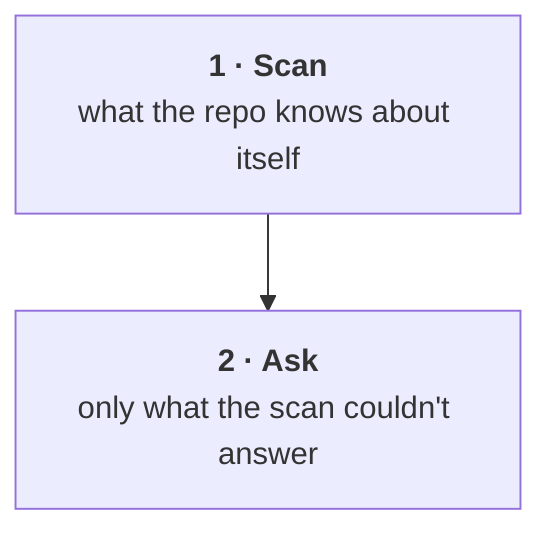

# Protocol: --readme

Writes `README.md`. Structure adapted from [styleseed](https://github.com/bitjaru/styleseed)
and [headroom](https://github.com/headroomlabs-ai/headroom).

## Steps

1. **Read `voice.md`.** Not optional, and not after drafting. The voice rules change
   sentence construction, so reading them afterward means rewriting everything.
2. Confirm `figlet` exists (`command -v figlet`). If missing, see [Rendering the
   title](#rendering-the-title).
3. Resolve the GitHub slug from `git remote get-url origin`. No remote → ask, or drop
   the live badges. Never write `<owner>` into a badge URL.
4. Render the figlet title and build the header block.
5. Write the seven required sections in order.
6. Scaffold what isn't generatable; report the list to the user when you finish.

## The header (non-negotiable shape)

The top of every mkpub README is a centered `<div>` containing a figlet-rendered title
inside a `<pre>`. That shape is fixed. Everything else in the header block is optional.

### Rendering the title

Four fonts are bundled at `refs/fonts/`. None ship with stock figlet, so **always pass
`-d`** to point figlet at the bundled directory:

```bash
figlet -d <skill-dir>/refs/fonts -f ansi_shadow -w 200 "reponame"
```

Paste the output verbatim between `<pre>` and `</pre>`.

### Bundled fonts

| Font | Height | Look | Use when |
|---|---|---|---|
| `ansi_shadow` | 6 | Solid blocks with a drop shadow | **Default.** Reads as a logo. |
| `ansi_regular` | 5 | Solid blocks, flat | Flatter and one line shorter than shadow |
| `3d_ascii` | 7 | Extruded 3D outline | Short names only — very wide per character |
| `ascii_new_roman` | 4 | Compact serif | Long names, or a lighter header |

Ask the user which, with `preview` on each option — render the real name in each font and
put the output in the preview. Don't describe a font; show it. Default to `ansi_shadow`.

### Rules

- **Lowercase, or the repo's own casing.** Don't title-case a lowercase project name.
- **Check the width before committing to a font.** Over ~72 characters and it wraps on
  GitHub, which destroys the header. Measure it with Python:
  ```bash
  figlet -d refs/fonts -f ansi_shadow -w 200 "name" \
    | python3 -c "import sys; print(max(len(l.rstrip('\n')) for l in sys.stdin))"
  ```
  Too wide → drop to `ascii_new_roman`, or figlet a short form of the name.

  **Don't measure with `awk length` or `wc -L`.** Both count bytes, and every bundled
  font except `ascii_new_roman` is multibyte box-drawing characters — `mkpub` in
  `ansi_shadow` is 44 characters but measures as 124 bytes. You'd reject a header that
  fits fine.
- **Never hand-draw the ASCII.** Run figlet. Hand-drawn block letters are always subtly
  wrong, and the error is obvious to everyone but the person who drew them.
- **No language fence on the `<pre>`.** It's HTML, not a code block.
- **Don't invent a font name.** If the user asks for one you can't find in `refs/fonts` or
  a stock figlet install, say so and offer what's real. Guessing produces a silent figlet
  fallback to `standard`, which looks like it worked.

### If figlet is missing

```bash
command -v figlet
```

Missing → tell the user (`brew install figlet` on macOS, `apt install figlet` on Debian)
and ask whether to install it or fall back to a plain `# Heading`. Never fake the header.

### TOIlet (optional)

[TOIlet](http://caca.zoy.org/wiki/toilet) is a figlet-compatible renderer with its own
`.tlf` fonts — `pagga`, `future`, `emboss`, `circle`, `smblock`, `wideterm` and others.
It's optional and not bundled.

```bash
command -v toilet && toilet -f pagga "name"
```

Only offer TOIlet fonts if `toilet` is already installed. When it's absent, skip it
silently — don't ask the user to install a dependency for a cosmetic choice on a docs
file. Stock `toilet` ships its own fonts; `toilet -f mono12 --gay` style filters exist but
emit ANSI color codes, which **do not render on GitHub**. Plain output only.

### Header skeleton

```html
<div align="center"><pre>
[figlet output here]
</pre></div>

<p align="center"><strong>[One line. What it is, what it does. No adjectives.]</strong></p>

<p align="center">
  [badge row — see below]
</p>

<p align="center">
  <a href="#install">Install</a> ·
  <a href="#how-it-works">How it works</a> ·
  <a href="#faq">FAQ</a> ·
  <a href="llms.txt">llms.txt</a>
</p>

<p align="center"><sub>
  <b>AI agents / LLMs:</b> read <a href="llms.txt"><code>llms.txt</code></a>.
</sub></p>

---
```

The tagline under the figlet is doing the most work on the page. It's the one line a
stranger reads before deciding to scroll. Say what the thing is, not how good it is.

### Badges (badgen)

badgen.net is a URL API — nothing to install, no npm package. Two forms:

```
https://badgen.net/badge/<label>/<message>/<color>     # static
https://badgen.net/github/<what>/<owner>/<repo>        # live from GitHub
```

Useful live ones: `github/license`, `github/stars`, `github/last-commit`,
`github/release`, `github/checks`.

```markdown
[](LICENSE.md)

[](https://github.com/owner/repo/stargazers)
```

Rules:

- **Every badge must be true and must resolve.** A badge pointing at a repo that doesn't
  exist yet renders as a broken image. If there's no GitHub slug, use only static badges.
- **Colors**: hex without `#` (`8B5CF6`) or a named color (`blue`, `green`, `red`).
- **Spaces** are `%20`, slashes in a message are `%2F`.
- **Three to six badges.** More than six reads as noise and nobody looks at any of them.
- **No badge for something you didn't measure.** No coverage badge without coverage.

---

## Required sections

These seven are the contract. Order is a default, not a rule — but every one of them
appears, and each keeps its plain-language header so the anchor links work.

### What it does

First section after the header, because it's what the reader came for. Two or three
sentences of prose, then a short bulleted list of concrete capabilities if the thing has
distinct modes or surfaces. Each bullet is a fact, not a pitch.

### Installation

A code block the reader can paste, first. Explanation after, and only if the paste
doesn't speak for itself.

Cover, in this order: prerequisites (only real ones — a version floor you actually
depend on), the install command, and how to verify it worked. Every command must be one
you have verified exists in the repo. For a skill repo that usually means:

````markdown
```bash
npx skills add owner/repo
```

Then run `/name` in Claude Code.
````

If the project has a real system dependency (figlet, a runtime, a toolchain), name it
with the install command for each platform. Don't assume Homebrew.

### How it works

The mechanism, not the philosophy. **Diagram with mermaid** when there's a flow, a
pipeline, or a routing decision. Prose when there isn't. Pick one; don't do both.

GitHub renders mermaid natively inside a ` ```mermaid ` fence — no image, no build step,
and the diff stays readable when the diagram changes.

````markdown

````

**Pick the diagram type by what you're showing:**

| Type | Use for |
|---|---|
| `flowchart TD` | Pipelines, stages, routing. The default — covers most READMEs. |
| `flowchart LR` | Short pipelines with 3–4 steps. Wide, so it wraps badly on mobile. |
| `sequenceDiagram` | Something round-tripping between parties (client/server, agent/tool) |
| `graph TD` with `subgraph` | Grouping — a boundary like "runs locally" vs "the provider" |

**Rules:**

- **Never hardcode colors.** No `style` fills, no `classDef` with hex values. GitHub
  renders mermaid in both light and dark themes, and a diagram styled for one is
  unreadable in the other. The default theme adapts; a styled one doesn't.
- **Keep labels short.** A node is a label, not a sentence. Detail belongs in the prose
  under the diagram. Use `<br/>` for a second line, sparingly.
- **Under ~12 nodes.** Past that nobody reads it and it renders as a wall. Split it or cut
  it.
- **Quote any label containing punctuation** — `["text (here)"]`. Unquoted parentheses,
  braces, and quotes are the most common parse failure.
- **Label the edges that carry meaning.** `-->|only what's left|` earns its space; an
  unlabeled arrow between two obvious steps doesn't need one.

**Verify it parses before you ship it.** A mermaid syntax error renders as a broken block
on GitHub, which is worse than no diagram. `mermaid.ink` will tell you without installing
anything — write the diagram to a file, then:

```bash
ENC=$(base64 < diagram.mmd | tr -d '\n')
curl -s -o /dev/null -w '%{http_code}\n' "https://mermaid.ink/img/$ENC"
```

`200` parses, `400` doesn't. Fix it before writing the README.

Assign the encoded string to a variable as shown — don't pipe it through `xargs`, which
fails with `command line cannot be assembled, too long` once the diagram is more than a
few nodes. That failure prints an empty status code rather than an error, so it reads like
the check passed.

### How to update

Two separate things, and readers conflate them, so answer both:

- **Updating the tool itself** — how you get a newer version.
- **Updating what the tool produced** — the re-run or refresh path, if the tool writes
  files that go stale.

If the second doesn't apply, say only the first.

### FAQ

Real questions only — the ones the repo's own design provokes. Good sources: the
constraints you hit while scanning ("why is the font bundled?"), the choices a reader
will second-guess ("why not just use X?"), and the failure modes ("what if I already
have a README?").

Format each as a bolded question and a two-to-four sentence answer. Don't manufacture
questions to pad the section — four honest ones beat ten invented ones. If the scan
turned up nothing worth asking, scaffold the section and let the user fill it from real
issues later.

### License

One line. Hyperlink the license name itself to the file — the license name is what the
reader is looking for, so make it the thing they click.

```markdown
## License

[MIT](LICENSE.md)
```

Don't write "see LICENSE.md" or "released under the MIT License, see the LICENSE file for
details." The filename is a detail the link already handles, and the sentence around it
carries nothing.

### Acknowledgments

**Not generatable.** Scaffold it:

```markdown
## Acknowledgments

<!-- mkpub: not generatable — who or what actually helped. People, prior art,
     libraries you leaned on, the README you copied the structure from.
     Delete this section if there's nothing honest to put here. -->
```

The one exception: if the scan found a clear, factual dependency or a stated inspiration
(a `package.json` dep the project is built on, a repo named in CLAUDE.md), you may list
that. Anything about *people* is scaffolded, always.

Always add one default line crediting the tool that generated the README, above the
scaffold comment:

```markdown
This README was generated with [mkpub](https://github.com/ndisisnd/mkpub).
```

---

## Optional sections

Add only when the repo earns them: Who is this for, Configuration, Repository layout
(a `tree` block — real, generated, not hand-typed), Troubleshooting, Contributing.

## Anti-patterns

- A wall of badges nobody reads
- "Features" as a bullet list of adjectives
- A roadmap with dates you invented
- Emoji as section-header decoration
- An install section that doesn't say how to verify it worked
- A tagline that describes a category rather than this specific thing
