<div align="center"><pre>
███╗   ███╗██╗  ██╗██████╗ ██╗   ██╗██████╗ 
████╗ ████║██║ ██╔╝██╔══██╗██║   ██║██╔══██╗
██╔████╔██║█████╔╝ ██████╔╝██║   ██║██████╔╝
██║╚██╔╝██║██╔═██╗ ██╔═══╝ ██║   ██║██╔══██╗
██║ ╚═╝ ██║██║  ██╗██║     ╚██████╔╝██████╔╝
╚═╝     ╚═╝╚═╝  ╚═╝╚═╝      ╚═════╝ ╚═════╝ 
</pre></div>

<p align="center"><strong>A Claude Code skill that writes the four files a repo needs before it goes public.</strong></p>

<p align="center"><sub>README.md · LICENSE.md · SECURITY.md · llms.txt — from a scan of the repo itself</sub></p>

<p align="center">
  <a href="LICENSE.md"></a>
  
  
  
</p>

<p align="center">
  <a href="#installation">Install</a> ·
  <a href="#how-it-works">How it works</a> ·
  <a href="#how-to-update">Update</a> ·
  <a href="#faq">FAQ</a> ·
  <a href="llms.txt">llms.txt</a>
</p>

<p align="center"><sub>
  <b>AI agents / LLMs:</b> read <a href="llms.txt"><code>llms.txt</code></a>.
</sub></p>

---

## What it does

mkpub reads your repository, asks about the things it can't work out on its own, and
writes the four files a stranger needs when they land on your repo cold. It was built for
skill repos — where the product is markdown and there's no package to point at — but it
works on any repository.

The README it generates has a fixed shape: a centered figlet title, a tagline, a badgen
badge row, and seven sections covering what the project does, how to install it, how it
works, how to update it, an FAQ, the license, and acknowledgments.

- **`--readme`** — `README.md` with a figlet header and live badges
- **`--license`** — `LICENSE.md`, after asking which license you want
- **`--security`** — `SECURITY.md`, with a reporting channel that actually resolves
- **`--llms`** — `llms.txt`, an index for agents landing in the repo
- **`--update`** — checks all four against the repo and refreshes what drifted
- **`--init`** — all four (this is also what running with no arguments does)

Flags combine. `/mkpub --readme --llms` runs both.

## Installation

```bash
npx skills add ndisisnd/mkpub
```

Then run `/mkpub` in Claude Code.

mkpub needs `figlet` for the README header. Everything else it uses — `git`, `curl` — you
already have:

```bash
brew install figlet        # macOS
sudo apt install figlet    # Debian, Ubuntu
sudo dnf install figlet    # Fedora
```

Verify it worked:

```bash
figlet -v      # any version is fine
```

If figlet is missing, mkpub tells you rather than falling back silently. The four header
fonts ship with the skill, so there's nothing else to install and the header renders the
same on every machine.

## How it works

Every mode runs the same three steps.

```mermaid
flowchart TD
    scan["<b>1 · Scan</b><br/>README · CLAUDE.md · ARCHITECTURE<br/>package.json · SKILL.md · git remote"]
    ask["<b>2 · Ask</b><br/>one AskUserQuestion call<br/>license · font · slug · audience"]
    router{"<b>3 · Write</b><br/>SKILL.md routes by mode"}

    scan -->|what the repo knows about itself| ask
    ask -->|only what the scan couldn't answer| router

    router -->|--readme| readme[protocol-readme] --> f1["README.md"]
    router -->|--license| license[protocol-license] --> f2["LICENSE.md"]
    router -->|--security| security[protocol-security] --> f3["SECURITY.md"]
    router -->|--llms| llms[protocol-llms] --> f4["llms.txt"]
    router -->|--update| update[protocol-update] --> f5["refreshed files"]
```



**The scan comes first** so that asking stays cheap. A question you could have answered by
reading `package.json` is a question that shouldn't be asked, and mkpub batches whatever's
left into a single prompt rather than interrupting once per file.

**`SKILL.md` is a router.** It holds the rules that apply everywhere — never invent facts,
never clobber an existing file, always ask before deciding — then dispatches to one
protocol per mode. Each protocol is read only when its mode runs, so a `--license` run
never loads the README rules.

**Nothing gets invented.** Some things can't be generated honestly: acknowledgments,
benchmarks, screenshots, contributor lists. mkpub writes the heading, leaves an HTML
comment saying what belongs there, and tells you which sections it scaffolded when it
finishes. A section you have to fill in yourself is better than a plausible fabrication
you have to find first.

**Nothing gets clobbered.** If a file already exists, mkpub reads it and asks whether to
merge, replace, or skip. Merging keeps your sentences and changes only the scaffolding —
your own words are usually the most valuable thing in an existing README.

## How to update

**Updating mkpub itself** — re-run the install; it overwrites the skill in place:

```bash
npx skills add ndisisnd/mkpub
```

**Updating the files mkpub wrote** — this is what `--update` is for:

```
/mkpub --update
```

It re-scans the repo, compares it against what the four files claim, and refreshes only
what drifted: version numbers, install commands, renamed skills, dead links, the
copyright year, the supported-version table.

`--update` is a diff, not a rewrite. A claim that's still true doesn't get touched, even
if mkpub would phrase it differently — your wording isn't drift. It's looking for false
statements, not improvable ones. Anything you chose rather than derived (license type,
tagline, audience) needs a question before it changes.

## FAQ

**Why bundle the fonts instead of using figlet's?**

None of the four ship with a stock figlet install. `ansi_shadow` — the default, and the
one that reads like a logo — isn't there, so a skill that assumed it would silently fall
back to `standard` and produce a header that looks like it worked. Bundling four `.flf`
files costs about 40KB and means the header renders identically everywhere.

**Why does it always ask about the license, even when `package.json` says MIT?**

That field is a leftover default more often than it's a decision. Licensing has
consequences you have to live with, and relicensing later can need every contributor's
consent, so mkpub confirms rather than infers. It recommends one — MIT for skill repos and
libraries — and puts it first.

**What if I already have a README I like?**

Choose **merge** when it asks. Your prose survives; mkpub restructures around it and fills
the gaps. Choose **skip** and it leaves the file alone entirely. It won't overwrite
anything substantive without asking first.

**Why does `llms.txt` matter if I already have a README?**

They're for different readers. A README explains the project to a person who'll scroll.
`llms.txt` is an index for an agent with a limited context window that needs to know which
three files to open and which to ignore. A README is prose; `llms.txt` is a map.

**Can I use it on something that isn't a skill repo?**

Yes. The scan looks for `package.json`, `pyproject.toml`, `Cargo.toml`, `ARCHITECTURE.md`
and the rest before it looks for skills, and falls back to walking the file tree. Skill
repos are just the case it's tuned for, because they're the case where there's no manifest
to read the answers out of.

**What about TOIlet, or other fonts?**

If `toilet` is already installed, mkpub will offer its `.tlf` fonts. It won't ask you to
install it — that's a big ask for a cosmetic choice on a docs file. Its color filters are
skipped either way, since ANSI escape codes don't render on GitHub.

## License

[MIT](LICENSE.md)

## Acknowledgments

- [figlet](https://www.figlet.org) for the font styling
- Lots of other Claude skill repos who have sick READMEs

<!-- mkpub: not generatable — who or what actually helped. People, prior art, libraries
     you leaned on. Delete this section if there's nothing honest to put here.

     Facts the scan did turn up, if you want to keep any of them:
       - README structure adapted from bitjaru/styleseed and headroomlabs-ai/headroom
       - Fonts from github.com/xero/figlet-fonts (ansi_shadow, ansi_regular,
         3d_ascii, ascii_new_roman)
       - figlet — github.com/cmatsuoka/figlet
       - Badges rendered by badgen.net
       - llms.txt format follows llmstxt.org
-->
